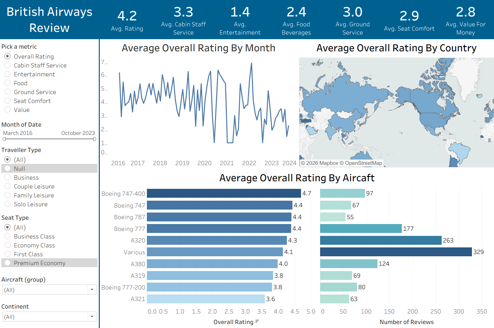

# British-Airways-Review-Dashboard
An interactive Tableau dashboard project designed to analyze British Airways customer reviews, service ratings, aircraft performance, and traveler satisfaction trends.

## Project Overview

This project analyzes British Airways customer review data to understand passenger satisfaction across different service areas, aircraft types, traveller categories, countries, and time periods.

The goal of this dashboard is to turn raw review data into clear business insights that can help identify service strengths, customer pain points, and areas for improvement.

🔗 [View Interactive Dashboard](https://public.tableau.com/app/profile/serena.z4354/viz/BritishAirwaysReviewDashboard_17789797590430/Dashboard)

## Key Metrics Analyzed

The dashboard tracks several customer satisfaction metrics, including:

- Overall Rating
- Cabin Staff Service
- Entertainment
- Food and Beverages
- Ground Service
- Seat Comfort
- Value for Money

## Key Insights

The average overall rating is **4.2**, showing the general level of customer satisfaction across the dataset.

Entertainment received the lowest average score at **1.4**, indicating that in-flight entertainment may be one of the biggest areas for improvement.

The monthly trend chart shows that overall ratings changed significantly over time, helping identify periods where customer satisfaction improved or declined.

The country-level map highlights differences in customer satisfaction across regions, making it easier to understand where British Airways performs well and where service experience may need improvement.

The aircraft analysis shows that some aircraft types received higher average ratings than others. For example, the Boeing 747-400 had one of the highest average ratings, while the A321 received a lower average rating. The dashboard also includes the number of reviews for each aircraft type, which helps compare ratings with sample size.

## Dashboard Features

This interactive dashboard includes filters that allow users to explore the data by:

- Review metric
- Month and year
- Traveller type
- Seat type
- Aircraft group
- Continent

These filters make it easier to compare customer experiences across different passenger groups and travel conditions.

## Business Value

This project demonstrates how customer review data can be transformed into actionable insights. The dashboard can help stakeholders:

- Identify low-performing service areas
- Compare customer satisfaction across aircraft types
- Monitor rating trends over time
- Understand geographic differences in customer experience
- Support data-driven decisions to improve passenger satisfaction
